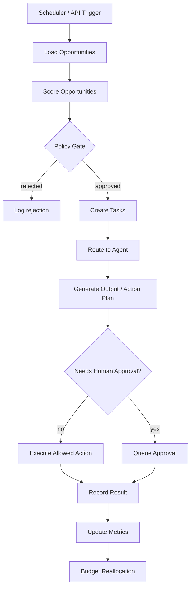
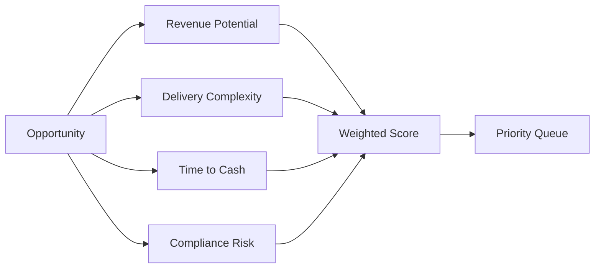
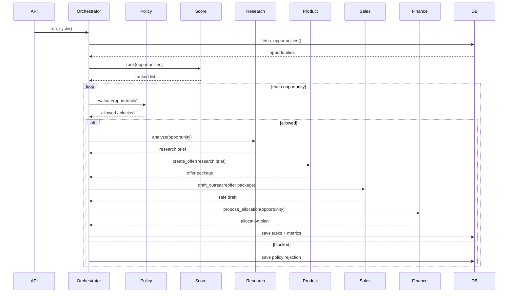
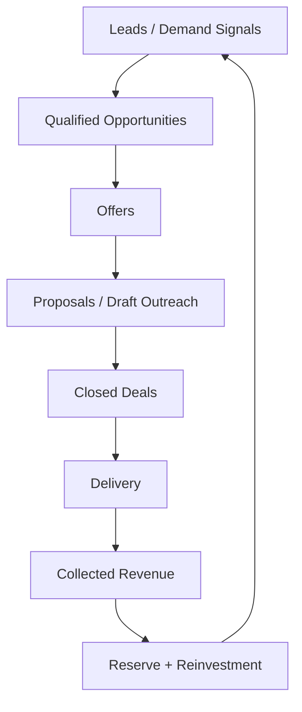
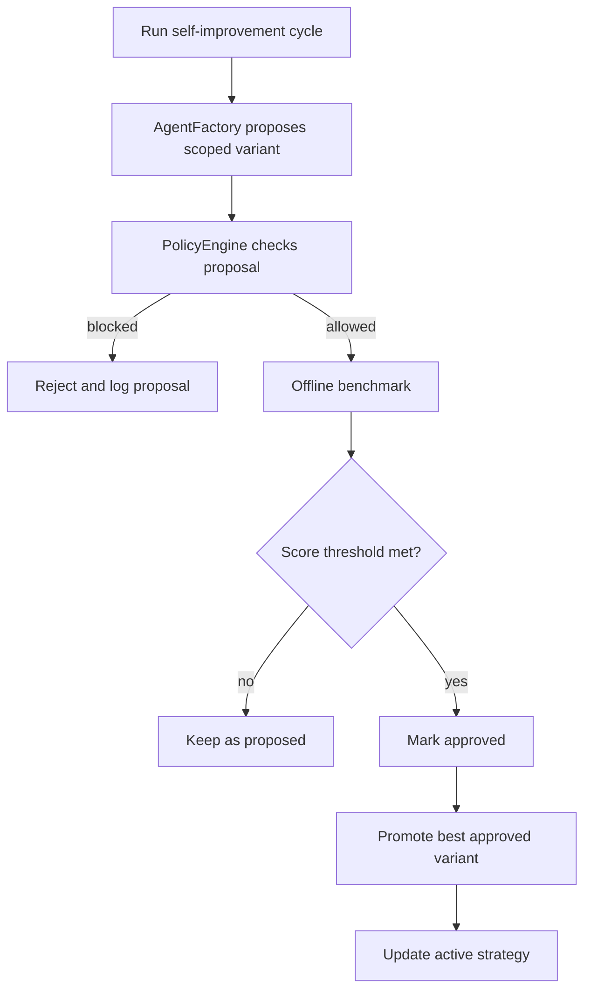
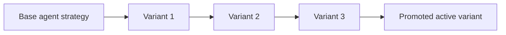

# Workflow Diagrams

## 1) End-to-end orchestration flow

## 2) Opportunity scoring pipeline

## 3) Agent interaction model

## 4) Revenue loop

## 5) Bounded self-improvement loop

## 6) Variant lineage

